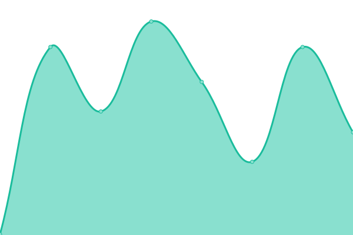

# [📈 Live Status](https://demo.upptime.js.org): <!--live status--> **🟧 Partial outage**

This repository contains the open-source uptime monitor and status page for [Upptime](https://upptime.js.org), powered by [Upptime](https://github.com/upptime/upptime).

With [Upptime](https://upptime.js.org), you can get your own unlimited and free uptime monitor and status page, powered entirely by a GitHub repository. We use [Issues](https://github.com/upptime/upptime/issues) as incident reports, [Actions](https://github.com/duckyfuz/upptime-checker/actions) as uptime monitors, and [Pages](https://demo.upptime.js.org) for the status page.

<!--start: status pages-->
<!-- This summary is generated by Upptime (https://github.com/upptime/upptime) -->
<!-- Do not edit this manually, your changes will be overwritten -->
<!-- prettier-ignore -->
| URL | Status | History | Response Time | Uptime |
| --- | ------ | ------- | ------------- | ------ |
|  [Portfolio Site](https://www.kenf.dev/) | 🟩 Up | [portfolio-site.yml](https://github.com/duckyfuz/upptime-checker/commits/HEAD/history/portfolio-site.yml) | 

 207ms
     
 | 

<a href="https://status.kenf.dev/history/portfolio-site">99.72%</a>
    

|  [Resume Hosting](https://resume.kenf.dev/) | 🟩 Up | [resume-hosting.yml](https://github.com/duckyfuz/upptime-checker/commits/HEAD/history/resume-hosting.yml) | 

 1229ms
     
 | 

<a href="https://status.kenf.dev/history/resume-hosting">100.00%</a>
    

|  [Notes Hosting](https://notes.kenf.dev/) | 🟥 Down | [notes-hosting.yml](https://github.com/duckyfuz/upptime-checker/commits/HEAD/history/notes-hosting.yml) | 

 101ms
     
 | 

<a href="https://status.kenf.dev/history/notes-hosting">0.00%</a>
    

|  [IFS Hosting](https://ifs.kenf.dev/) | 🟥 Down | [ifs-hosting.yml](https://github.com/duckyfuz/upptime-checker/commits/HEAD/history/ifs-hosting.yml) | 

 150ms
     
 | 

<a href="https://status.kenf.dev/history/ifs-hosting">0.00%</a>
    

|  Production Site - GT | 🟩 Up | [production-site-gt.yml](https://github.com/duckyfuz/upptime-checker/commits/HEAD/history/production-site-gt.yml) | 

 247ms
     
 | 

<a href="https://status.kenf.dev/history/production-site-gt">100.00%</a>
    

|  Production Site - HL | 🟩 Up | [production-site-hl.yml](https://github.com/duckyfuz/upptime-checker/commits/HEAD/history/production-site-hl.yml) | 

 561ms
     
 | 

<a href="https://status.kenf.dev/history/production-site-hl">100.00%</a>
    

<!--end: status pages-->

[**Visit our status website →**](https://demo.upptime.js.org)

## 📄 License

- Powered by: [Upptime](https://github.com/upptime/upptime)
- Code: [MIT](./LICENSE) © [Anand Chowdhary](https://anandchowdhary.com), supported by [Pabio](https://pabio.com)
- Data in the `./history` directory: [Open Database License](https://opendatacommons.org/licenses/odbl/1-0/)
